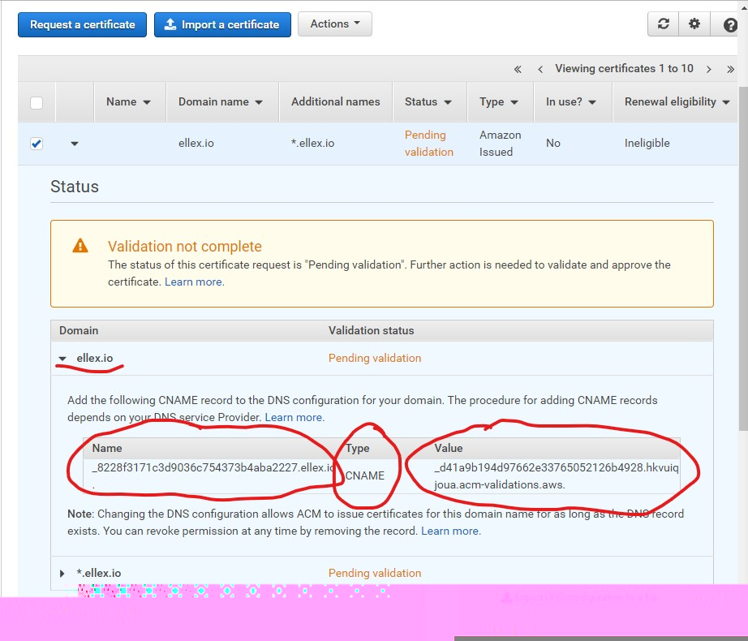

# CoinTrader v3

**Table of Contents**
  * [Configs](#configs)
      * [Chart config](#chart-config)
  * [Translation](#translation)
      * [New Translation Messages](#new-translation-messages)
      * [Translation Main Config](#translation-main-config)
      * [POEditor Config](#poeditor-config)
      * [Update Translation](#update-translation)
  * [Commands](#commands)
  * [Affiliate Link](#affiliate-link)
  * [FormContainer (Component)](#formcontainer-component)
  * [Dev Environment](#dev-environment)
      * [Setup](#setup)
      * [Run Local Dev Server](#run-local-dev-server)
      * [Run Tests](#run-tests)
  * [CloudFront Link to S3 Deployment](#cloudfront-link-to-s3-deployment)
    * [Get s3bucket Distribution Url and Error Document](#get-s3bucket-distribution-url-and-error-document)
    * [Create SSL Cert through AWS Certificate](#create-ssl-cert-through-aws-certificate)
     * [Create CloudFront Distribution](#create-cloudfront-distribution)
     * [Update Domain Provider with CloudFront Distribution URL](#update-domain-provider-with-cloudfront-distribution-url)
  * [Maintenance Mode and Message](docs/maintenanceMode.md)

# Configs:
### Chart Config
Available at (./config/config.js)
- `candleStickChart` options are `FXBLUE`, `TV_EXTERNAL_DATA` or `TV_EXCHANGE_DATA`
- `TVProvider` options are `Coinbase` or `Bitfinex`
- `hideTVLegend` options are boolean
- `theme` options are `DARK` or `LIGHT`

```
chartConfig: {
  candleStickChart: "TV_EXTERNAL_DATA",
  TVProvider: "Coinbase"
  hideTVLegend: true,
  theme: "DARK"
},


```

[Back to Top](#cointrader-v3)

# Translation:
#### New translation messages:
- New translation messages must be added only on POEditor website. Do not use the file `/src/lang.js`. It is on the repository for back compatibility, until all messages are migrated to POEditor.
- New entries must be added/updated on the Project's dashboard (not in the language's dashboard).
- After new terms were added/updated, go to the language's dashboard, lookup for the desired terms and insert/update the translation.
- Once you're done translation the terms, follow the instructions below to download the translated messages into the repository.

#### Translation main config:
Available at (./config/config.js)
```
{
    ...
    lang: {
        default: 'en', // Default language
        items: { // List of languages
            [code]: [name],
            en: 'English',
        }
    }
}
```

#### POEditor config: (./config/poeditorConfig.js)
```
{
    token: 'API_TOKEN',
    projectId: PROJECT_ID,
    languages: [code, code], // It generates based on 'Main config'
}
```

### Update translation: 
- Run command `npm run command:translation:download` in root folder
- Command creates json files based on config `languages` inside `./lang/[langCode].json`
- Create new branch in git repo
- Push changes to git
- Create Pull Request

# Commands:

```sh
 'npm run command:translation:download' -  Download last version of languages from poeditors and generates json files 
```

[Back to Top](#cointrader-v3)

# Affiliate link
#### There are two ways to use affiliate programs
- Use previous site domain (app will check previous site via browser history). NOTE: all domains should be set to config
- Use GET parameter `aff` (as for example: domain.com?aff=someName). NOTE: This way have heigher priority than browser history. Client should not set this in config

#### Information about affiliate program will be saved to `External ID` on backend backend

#### Client can enable affiliate program via config. Also there should be set list of available domain names inside config
### Configs:
#### Main config (./config/config.js)
```
{
    ...
    affiliatePrograms: {
        enabled: true, 
        items: ['someDomainName.com'], // List of affiliant programs
    }
}
```

[Back to Top](#cointrader-v3)

# FormContainer (Component)
#### FormContainer is a React component that is intended to render and handle a form based on an object, allowing forms to be configurable on the fly.

It handles:
- Configuration-based rendering
- Validations
- Translations
- File uploads with AWS S3
- Accessibility-friendly fields

#### See the documentation in here: /docs/FormContainer.md

[Back to Top](#cointrader-v3)

# Dev environment
### Setup
If this is the first time setting up your local environment, you'll need to clone the repository and install all the required packages, following these steps:
1. Clone the repository using of of the following commands:
SSH:    git clone git@github.com:ShiftForex/cointrader_v3.git (local-folder-name*)
HTTPS:  git clone https://github.com/ShiftForex/cointrader_v3.git (local-folder-name*)

*local-folder-name is optional, in case you want to specify a name for your local folder. Otherwise, it will be created as "cointrader_v3".

2. Install the required packages
```sh
'npm install' - Install all required packages.
```

### Run local dev server
Once your local environment is setup, you'll be able to run the dev server using the following command:
```sh
'npm run start:dev' - Launches a dev server (with hot replacement enabled) on your local machine.
```

### Run tests
Use the following command to run the tests before submitting a PR to your branch.
```sh
'npm run test' - Runs the unit tests created for the project.
```

In case your test fails, you may need to update the tests or run the command to update test snapshots.
To update test snapshots run the following command:
```sh
'npm test -- -u' - Updates the test snapshots.
```

PS: Make sure you commit and push the changed test files and test snapshot files.

[Back to Top](#cointrader-v3)

# CloudFront Link to S3 Deployment

### Steps for linking an AWS S3 bucket deployment to CloudFront (for https) and the client's domain provider

V3 Git branches with `s3/` appeneded to the beginning of the branch automatically deploy an AWS S3 Bucket through Travis CI. This workflow allows for:

- Automated Unit Testing
- Automated deployments
- Modularity of production deployments yet maintaining the scalabity of shared code resources

This also means these automated deployments need to be linked to our clients' domain names. These web products also need to be served over `https`. This means needing to:

- Creating a SSL Cert with Amazon Certificate Manager (ACM)
- Creating a CDN through CloudFront
- Linking the S3 Distribution to the SSL Cert and CloudFront Distribution for said client

Here are the steps for each to-do:

 1. [Get s3bucket distribution url and Error document](#get-s3bucket-distribution-url-and-error-document)
 2. [Create SSL Cert through AWS Certificate Manager](#create-ssl-cert-through-aws-certificate-manager)
 3. [Create CloudFront Distribution](#create-cloudfront-distribution)
 4. [Update Domain Provider with CloudFront Distribution URL](#update-domain-provider-with-cloudfront-distribution-url)


## Get s3bucket distribution url and Error document

- Go to AWS Console and select "Amazon S3"
- Search for bucket name which is the string post 's3/' in its git branch name
- Select said bucket and click 'Properties'


- Select 'Static website hosting'


- copy endpoint url string and notice input values for Index document and Error document

#### Note: will need to know the Error document file for 403 and 404 error handling for the cloudFront Distribution creation


[Back to Top](#cointrader-v3)

[Back to CloudFront Link to S3 Deployment](#cloudfront-link-to-s3-deployment)

## Create SSL Cert through AWS Certificate Manager

- Go to AWS Console and select "Certificate Manager"
- Click "Request a certificate" button


#### Note: make sure you are in the same region as s3 bucket distribution that you want to link

- Click 'Request a certificate' button


#### Note: "Request a public certificate" radio should be selected as default value and "Request a private certificate" should be disabled

- Add client domain names


#### Note: create two entries: `domainName.com` and `*.domainName.com`

- Select DNS validation and press the "Review" button
- After verifying request is proper click "Confirm and request"


- Download DNS configuration file and update client's domain provider DNS records with the validation records


#### Note: `_79c8cfd8893b37588751d092606cbbb9.cleintDomain. CNAME _someCrazyString.hkvuiqjoua.acm-validations.aws.` record provided by AWS lets it to verify that Shift is allowed to general ssl certificates for this domain. In layman's terms: So this one record basically says "Shift can generate SSL Certs for my domain." If the client ever removed it they would be saying "Shift cannot any longer generate new SSL for our domain."

If you or the client are not sure what fields to update or are looking to verify your DNS record updates go to the Certificate Manager UI and then select the `pending validation` domain to see what ACM is expecting from the domain provider.



#### Note: Remember the `dig` command is your friend in debugging DNS records  


[Back to Top](#cointrader-v3)

[Back to CloudFront Link to S3 Deployment](#cloudfront-link-to-s3-deployment)

## Create CloudFront Distribution

- Go to AWS Console and select "CloudFront"
- Click "Create Distribtuon"


- Click 'Get Started' button under the Web delivery method
- Update the following inputs:

   ##### Origin Settings

    - Origin Domain Name: use client's S3 URL

    ##### Default Cache Behavior Settings

    - Viewer Protocool Policy: Redirect HTTP to HTTPS
    - Allowed HTTP Methods: GET, HEAD, OPTIONS, PUT, POST, PATCH, DELETE

    ##### Distribution Settings

    - Alternate Domain Names (CNAMEs): `domainName.com` `*.domainName.com`
    - SSL Certificate: Custom SSL Certificate (Use the Cert created through the Certificate Manger - aka: ACM )
    - Default Root Object: index.html

  #### Note: You should be able to select the `Origin Domain Name` and `Custom SSL Certificate` from a dropdown once you click the input


[Back to Top](#cointrader-v3)

[Back to CloudFront Link to S3 Deployment](#cloudfront-link-to-s3-deployment)

## Update Domain Provider with CloudFront Distribution URL

Create a CNAME record with the domain provider linked to said CloudFront Distrubtion URL.
The CloudFront URL you are pointing the domain to should look something like this: `d1ndsia0ns38zk.cloudfront.net`

[Back to Top](#cointrader-v3)

[Back to CloudFront Link to S3 Deployment](#cloudfront-link-to-s3-deployment)
